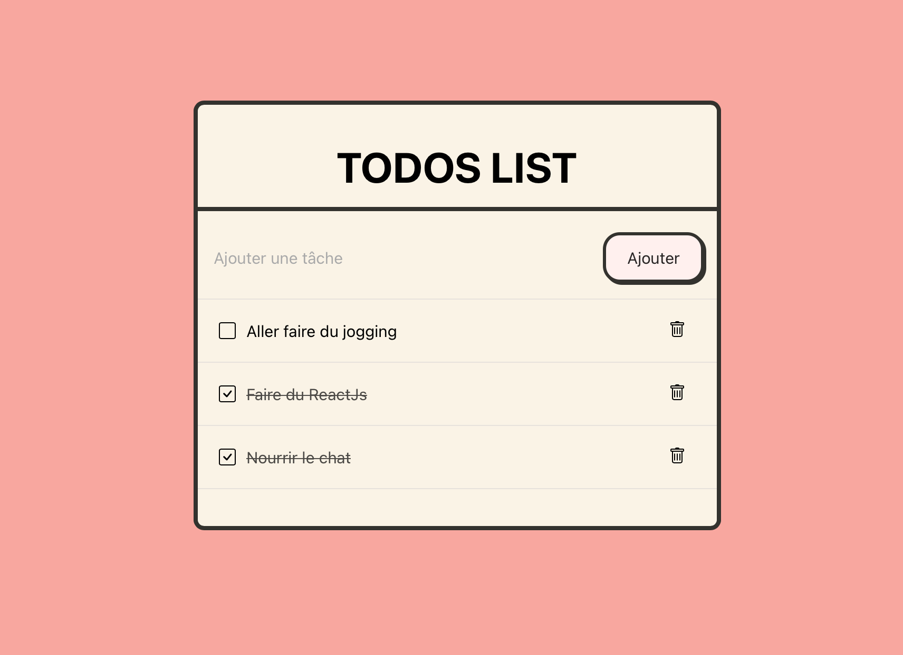

# Todo list ReactJs

Mini projet todo list en reactjs :  [Demo](https://iamansaka.github.io/react-todo-app/).



## Etapes d'installation
```bash
git clone https://github.com/iamansaka/react-todo-app.git
```
Clone le projet sur votre machine

```bash
npm install
```
Installe toutes les dépendances du projet
```bash
npm start
```
Cette commande lance le serveur de développement : [http://localhost:3000](http://localhost:3000).